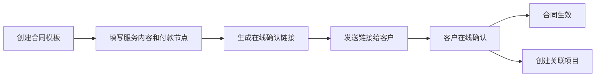
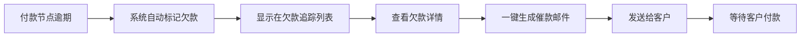

## 1. 产品概述

自由职业者合同与项目收款管理工具，帮助自由职业者高效管理合同、项目、收款、客户和财务数据。解决合同管理混乱、收款提醒不及时、收入统计困难、客户信息零散等痛点。

- 目标用户：独立设计师、开发者、咨询顾问等自由职业者
- 核心价值：一站式管理从签合同到收款的全流程，提升财务管理效率

## 2. 核心功能

### 2.1 功能模块

1. **仪表盘首页**：收入概览、待办提醒、项目进度、欠款预警
2. **合同管理**：合同模板创建、在线确认链接生成、合同状态追踪
3. **项目管理**：项目列表、项目详情、付款节点管理、文件管理
4. **收款管理**：收款记录、付款提醒、欠款追踪、催款邮件生成
5. **客户管理**：客户信息、历史合作、客户分级
6. **收入统计**：年度汇总、月度趋势、分类统计、报税辅助

### 2.2 页面详情

| 页面名称 | 模块名称 | 功能描述 |
|---------|---------|---------|
| 仪表盘 | 收入概览卡片 | 显示年度/月度实收金额、待收金额、欠款金额 |
| 仪表盘 | 快捷操作区 | 新建合同、新建项目、查看欠款 |
| 仪表盘 | 项目进度列表 | 显示进行中项目及付款节点状态 |
| 仪表盘 | 提醒通知区 | 到期付款、逾期欠款、待确认合同 |
| 合同列表 | 合同卡片列表 | 展示所有合同，支持状态筛选和搜索 |
| 合同新建/编辑 | 合同表单 | 服务内容、交付物、总价、付款节点(30%/50%/20%) |
| 合同详情 | 合同预览 | 合同全文预览、生成确认链接、查看确认状态 |
| 项目列表 | 项目卡片列表 | 展示所有项目，按状态分组 |
| 项目详情 | 基本信息 | 项目名称、客户、金额、状态、进度 |
| 项目详情 | 付款节点 | 各节点金额、到期日、状态、收款操作 |
| 项目详情 | 文件管理 | 上传需求文档、交付文件，支持预览和下载 |
| 客户列表 | 客户卡片 | 客户基本信息、合作次数、累计金额 |
| 客户详情 | 客户信息 | 联系方式、备注、客户标签 |
| 客户详情 | 合作历史 | 历史项目列表、合同记录 |
| 收入统计 | 月度趋势图 | 按月展示收入趋势柱状图 |
| 收入统计 | 年度汇总 | 年度总收入、已收、待收、欠款 |
| 收入统计 | 分类统计 | 按客户、按项目类型统计 |
| 欠款追踪 | 欠款列表 | 按逾期天数排序的欠款明细 |
| 欠款追踪 | 催款功能 | 一键生成催款邮件草稿 |

## 3. 核心流程

### 合同签署流程

### 项目收款流程

```mermaid
flowchart LR
    A["项目启动"] --> B["定金30%到期提醒"]
    B --> C["客户支付/确认转账"]
    C --> D["标记收款完成"]
    D --> E["项目进行中"]
    E --> F["验收款50%到期提醒"]
    F --> G["客户支付/确认转账"]
    G --> H["标记收款完成"]
    H --> I["项目交付"]
    I --> J["尾款20%到期提醒"]
    J --> K["客户支付/确认转账"]
    K --> L["项目结清"]
```

### 欠款追踪流程

## 4. 用户界面设计

### 4.1 设计风格
- **主色调**：深墨绿(#0D4F3C)作为主色，传达专业、信任、财富感
- **辅助色**：琥珀金(#D4A853)作为强调色，用于重要操作和状态高亮
- **中性色**：暖白色背景(#FAF8F5)、深灰文字(#2C2C2C)、中灰辅助(#6B6B6B)
- **警示色**：柔和红(#C9564B)用于欠款提醒，翠绿(#2D8659)用于已收款
- **整体风格**：精致商务风，类高端金融工具质感，留白充足，排版优雅

### 4.2 视觉元素
- **字体**：标题使用 Lora 衬线体（优雅专业），正文使用 Inter 无衬线体（清晰易读）
- **卡片**：圆角 12px，细腻阴影，hover 时轻微上浮
- **按钮**：主按钮实心深墨绿，次要按钮描边，圆角 8px
- **图标**：使用 Lucide 图标库，统一线性风格
- **数据可视化**：使用 Recharts 绘制收入趋势图，配色与整体风格统一

### 4.3 页面设计概览

| 页面名称 | 模块名称 | UI 元素 |
|---------|---------|--------|
| 仪表盘 | 顶部统计卡片 | 渐变背景、大号数字、趋势箭头、图标装饰 |
| 仪表盘 | 项目进度条 | 线性进度条、节点标记、颜色区分状态 |
| 合同列表 | 合同状态标签 | 胶囊状标签，不同颜色对应不同状态 |
| 合同详情 | 合同预览区 | 模拟A4纸张效果，浅色边框，阴影层次 |
| 项目详情 | 付款时间线 | 垂直时间线，节点状态图标，金额高亮 |
| 收入统计 | 趋势图表 | 渐变柱状图，鼠标悬浮显示详情 |
| 欠款追踪 | 逾期天数徽章 | 红色背景，数字醒目，逾期越久颜色越深 |

### 4.4 响应式设计
- 桌面端优先（1280px 以上），侧边栏固定导航
- 平板端（768px-1280px）：侧边栏收起为图标栏
- 移动端（768px 以下）：底部 Tab 导航，卡片单列布局
