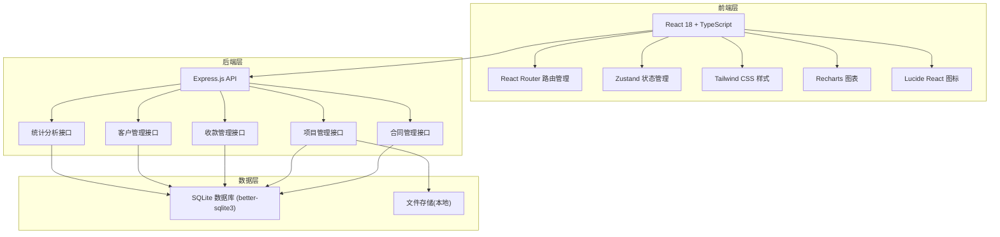
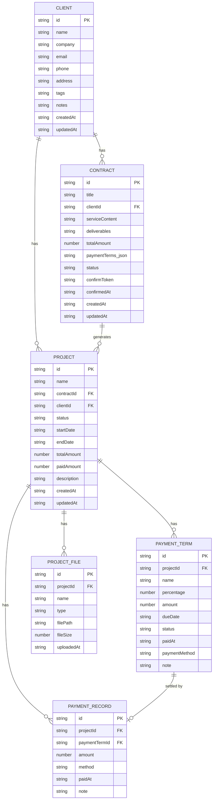

## 1. 架构设计



## 2. 技术描述

- **前端**：React@18 + TypeScript + Vite
- **样式**：Tailwind CSS@3
- **状态管理**：Zustand
- **路由**：React Router DOM@6
- **图表**：Recharts
- **图标**：Lucide React
- **后端**：Express.js@4 + TypeScript
- **数据库**：SQLite (better-sqlite3)，本地存储，无需额外部署
- **初始化工具**：vite-init
- **包管理**：npm

## 3. 路由定义

| 路由 | 页面 | 用途 |
|------|------|------|
| / | Dashboard | 仪表盘首页 |
| /contracts | ContractList | 合同列表 |
| /contracts/new | ContractForm | 新建合同 |
| /contracts/:id | ContractDetail | 合同详情 |
| /contracts/confirm/:token | ContractConfirm | 客户确认合同页 |
| /projects | ProjectList | 项目列表 |
| /projects/:id | ProjectDetail | 项目详情 |
| /clients | ClientList | 客户列表 |
| /clients/:id | ClientDetail | 客户详情 |
| /payments | PaymentTracker | 收款/欠款追踪 |
| /statistics | Statistics | 收入统计 |

## 4. API 定义

### 4.1 类型定义

```typescript
interface Client {
  id: string;
  name: string;
  company: string;
  email: string;
  phone: string;
  address: string;
  tags: string[];
  notes: string;
  createdAt: string;
  updatedAt: string;
}

interface Contract {
  id: string;
  title: string;
  clientId: string;
  serviceContent: string;
  deliverables: string;
  totalAmount: number;
  paymentTerms: PaymentTerm[];
  status: 'draft' | 'pending' | 'confirmed' | 'cancelled';
  confirmToken: string;
  confirmedAt: string | null;
  createdAt: string;
  updatedAt: string;
}

interface PaymentTerm {
  id: string;
  name: string;
  percentage: number;
  amount: number;
  dueDate: string | null;
  status: 'pending' | 'due' | 'paid' | 'overdue';
  paidAt: string | null;
  paymentMethod: 'online' | 'bank_transfer' | null;
  note: string;
}

interface Project {
  id: string;
  name: string;
  contractId: string | null;
  clientId: string;
  status: 'planning' | 'in_progress' | 'delivered' | 'completed' | 'cancelled';
  startDate: string;
  endDate: string | null;
  totalAmount: number;
  paidAmount: number;
  paymentTerms: PaymentTerm[];
  description: string;
  createdAt: string;
  updatedAt: string;
}

interface ProjectFile {
  id: string;
  projectId: string;
  name: string;
  type: 'requirement' | 'deliverable' | 'other';
  filePath: string;
  fileSize: number;
  uploadedAt: string;
}

interface PaymentRecord {
  id: string;
  projectId: string;
  paymentTermId: string;
  amount: number;
  method: 'online' | 'bank_transfer';
  paidAt: string;
  note: string;
}
```

### 4.2 接口列表

| 方法 | 路径 | 用途 |
|------|------|------|
| GET | /api/clients | 获取客户列表 |
| POST | /api/clients | 创建客户 |
| GET | /api/clients/:id | 获取客户详情 |
| PUT | /api/clients/:id | 更新客户 |
| DELETE | /api/clients/:id | 删除客户 |
| GET | /api/contracts | 获取合同列表 |
| POST | /api/contracts | 创建合同 |
| GET | /api/contracts/:id | 获取合同详情 |
| PUT | /api/contracts/:id | 更新合同 |
| GET | /api/contracts/confirm/:token | 客户确认合同 |
| POST | /api/contracts/:id/send | 发送合同确认链接 |
| GET | /api/projects | 获取项目列表 |
| POST | /api/projects | 创建项目 |
| GET | /api/projects/:id | 获取项目详情 |
| PUT | /api/projects/:id | 更新项目 |
| GET | /api/projects/:id/files | 获取项目文件列表 |
| POST | /api/projects/:id/files | 上传项目文件 |
| DELETE | /api/projects/:id/files/:fileId | 删除项目文件 |
| POST | /api/payments | 标记收款 |
| GET | /api/payments/overdue | 获取欠款列表 |
| POST | /api/payments/:id/reminder | 发送催款提醒 |
| GET | /api/statistics/summary | 获取收入统计摘要 |
| GET | /api/statistics/monthly | 获取月度收入数据 |
| GET | /api/statistics/by-client | 按客户统计收入 |

## 5. 数据模型

### 5.1 ER 图



### 5.2 初始化数据

系统启动时自动创建示例数据，包含3个示例客户、5个示例合同、4个示例项目及对应付款节点和文件。
